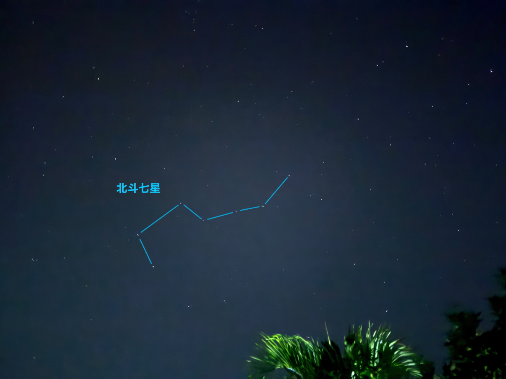
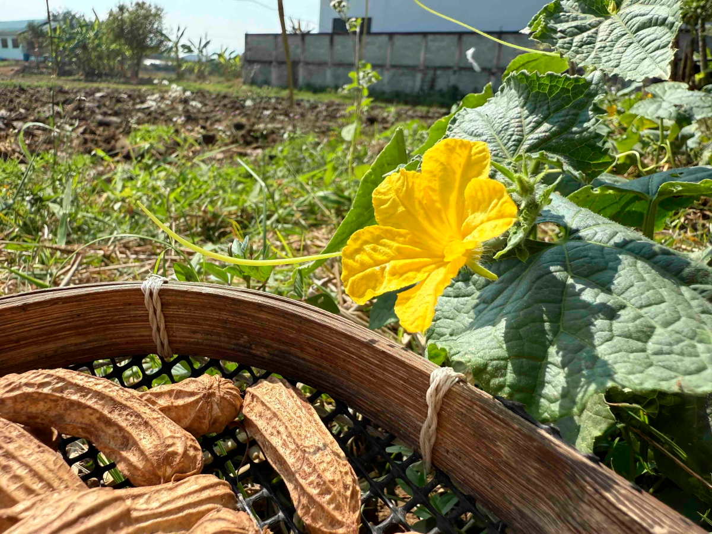

# 20250202_chiangrai

<html>
<head>

<meta charset="UTF-8">
<meta http-equiv="Content-Type" content="text/html; charset=UTF-8">
<meta http-equiv="X-UA-Compatible" content="IE=EmulateIE10" />
<meta http-equiv="X-UA-Compatible" content="IE=edge">

<!--ここから上はお決まりの定型文です-->

<!--ここからが表現の書式などを決めるcssという部分-->

<link href="https://cdnjs.cloudflare.com/ajax/libs/lightbox2/2.7.1/css/lightbox.css" rel="stylesheet">

</head>

<body>

モバイル端末をお使いの場合は、画面を横向きにすると
より見やすくご覧頂けます。

<!--ここ上は、ほぼそのまま使います！-->

<!--QRコードの挿入例-->

 アクセス用QRコード

<marquee direction="left" scrollamount="20" width="30%">(^_^)/~alis</marquee>

<!--流れ文字の挿入例-->
<h1><marquee behavior="left">!!! 2025/02/02、日の出前の北斗七星から、親戚宅でお昼など!!!</marquee></h1>

                          

<!--ここから下が、本体部分-->

<h2>夜明け前の北の空には北斗七星 朝4:45 北極星は硬度が低くて見えません</h2>

    
<h2>朝焼けはいつも通り綺麗です 朝7:13</h2>

    
<h2>ウーハー搭載のbtスピーカーでYouTube再生したら、重低音が響きます</h2>

    
<h2>久々にハスのお花が鉢の中でニッコリ</h2>

    
<h2>お昼は2日ぶりに親戚のお宅で！</h2>

    
<h2>屋外の重機作業は流石にお休みですが、熱帯の陽射しで豆の天日干し</h2>

    
<h2>この陽射しはなんでもないものでも輝かせます</h2>

    
<h2>先日のおじいちゃん、ほどよい風の中でお昼寝中</h2>

    
<h2>放置しすぎて育ちすぎた実</h2>

    
<h2>すでに次の実がスタンバッテます</h2>

    
<h2>この笑顔が手作りのお料理の味を一段とアップ！</h2>

    
<h2>アヒルの卵は、黄身の大きさが格別です</h2>

    
<h2>熱帯の乾季で地面はひび割れ</h2>

    
<h2>それでも地中深く根を張った木々は陽射しの恩恵で生き生き</h2>

<h2>ここからは夕焼けグラデーション</h2>

    
<h2>月はだんだん太くなります</h2>

    
<h2>月の高度が上がって、金星との位置が入れ替わりました</h2>

    
<h2>暗くなると、ちょっと左下に土星も並びます</h2>

<h2>今日のBGMはタイのポップス</h2>
<iframe width="560" height="315" src="https://www.youtube.com/embed/7eSLJH2geMw?si=P409uF-ocP2yQdiL" title="YouTube video player" frameborder="0" allow="accelerometer; autoplay; clipboard-write; encrypted-media; gyroscope; picture-in-picture; web-share" referrerpolicy="strict-origin-when-cross-origin" allowfullscreen></iframe> 

   
<h2>以上、夜明け前の北斗七星でスタート 親戚宅でお昼をいただき、最後は夕焼けグラデーションでした ここまで観ていただきありがとうございました。</h2>

     
<h2>
<a href="https://torokoid.github.io/20241126_chiangrai/" target="_blank">Back to the menu page</a>
</h2>

   

         

  

      

<!--本体はここまで-->

<!--画面に空白地帯を作って、背景が見えるようにしています-->
                                              

<!-- フッタ -->
<footer>

Copyright 2025/02/03 alis @ChiangRai

</footer>

<!--HPにさまざまなJavaScriptを呼び込むための書式-->

